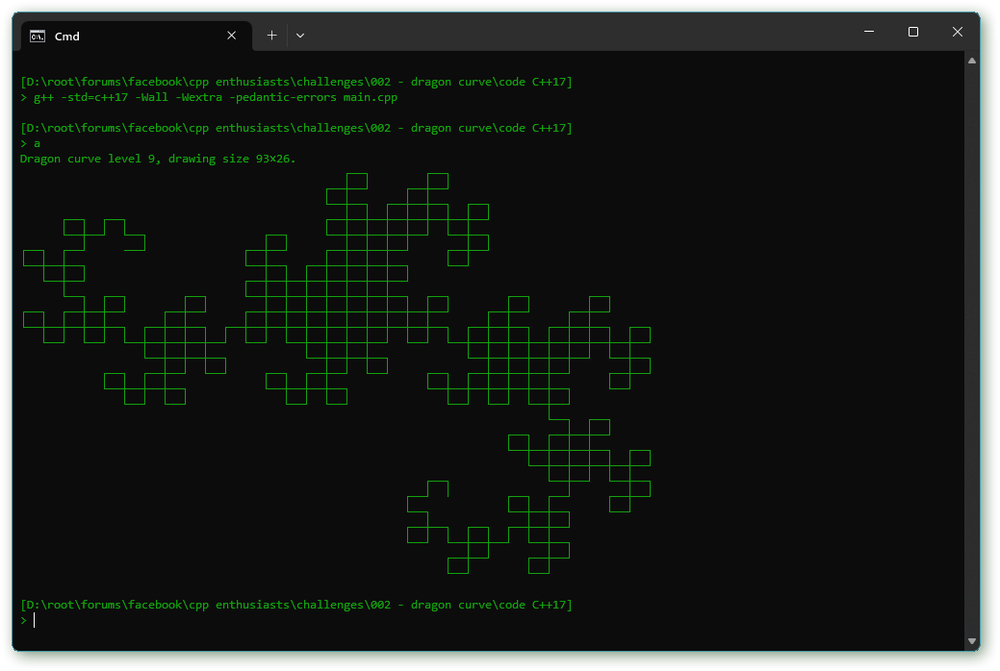

A little **challenge problem #2** for the group members and readers:

*Use the Unicode box drawing characters to display [the Dragon curve](https://en.wikipedia.org/wiki/Dragon_curve) or some other interesting curve, as shown in the screenshot (or similar).*

Wikipedia has a table of the box drawing characters at <url: https://en.wikipedia.org/wiki/Box-drawing_character>. Additionally this problem’s [GitHub repository]() has a file “box_drawing_characters.inc” with the raw data that I used to define the systematic characters collection for my own exploration. If you’re unfamiliar with the box drawing characters, this is the complete list of the *systematic* ones:

  ╷ ╻ ╶ ┌ ┎ ╺ ┍ ┏ ╵ │ ╽ └ ├ ┟ ┕ ┝ ┢ ╹ ╿ ┃ ┖ ┞ ┠ ┗ ┡ ┣ ╴ ┐ ┒ ─ ┬ ┰ ╼ ┮ ┲ ┘ ┤ ┧ ┴ ┼ ╁ ┶ ┾ ╆ ┚ ┦ ┨ ┸ ╀ ╂ ┺ ╄ ╊ ╸ ┑ ┓ ╾ ┭ ┱ ━ ┯ ┳ ┙ ┥ ┪ ┵ ┽ ╅ ┷ ┿ ╈ ┛ ┩ ┫ ┹ ╃ ╉ ┻ ╇ ╋

So, one of the problems here is to connect the graphics generation to resulting box drawing characters text. I doubt it can be done without some kind of 2D representation. A `Matrix_` class can therefore come in handy, and fortunately the C++ standard library doesn’t offer one. :-o

Unlike the first challenge there is no strong reason to avoid recursion, at least not for the Dragon curve. However, if you want to do this without recursion you can use a *Lindenmeyer system* where you repeatedly replace a specification with a more elaborate one. The L-system for the Dragon curve starts with the specification string “F”, and in each iteration a new string is composed via the replacement rules “F” → “F+G”, “G” → “F-G”, and with any other character mapped to itself. Then to display the curve interpret each “F” and “G” as a pen forward command, “-” as turn right, and “+” as turn left (or opposite, of course). That is, the L-system specification directs a turtle graphics drawing.

