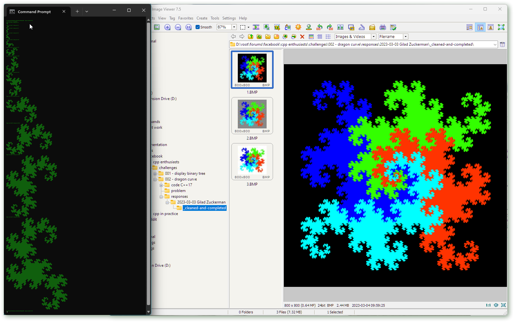
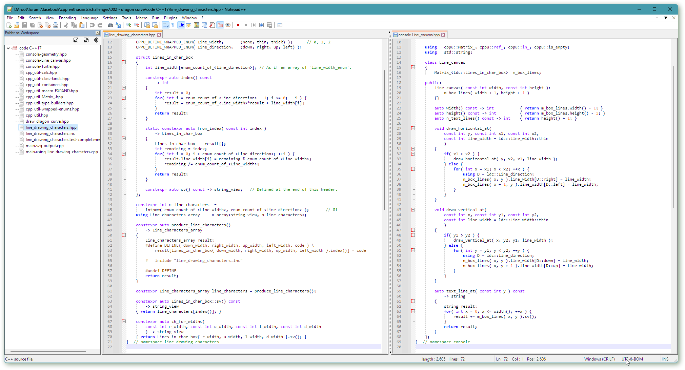

## Summary challenge #2 “Dragon curve of box characters”

The challenge of Tuesday 28ᵗʰ of February:

* ❝­*Use the Unicode box drawing characters to display [the Dragon curve](https://en.wikipedia.org/wiki/Dragon_curve) or some other interesting curve, as shown in the screenshot (or similar).*&ZeroWidthSpace;❞

 [Provided](https://github.com/alf-p-steinbach/CPPE-challenge-002---dragon-curve/tree/master/problem): (1) box drawing characters data; (2) an iterative Lindenmayer system based Dragon curve points function; and  a day or two later also (3) an example of using that for an SVG image.

As of Sunday 12ᵗʰ March no-one has posted a C++ presentation with box drawing characters. C++17 code for that is now available [in this challenge’s GitHub repository](https://github.com/alf-p-steinbach/CPPE-challenge-002---dragon-curve/tree/master/code%20C%2B%2B17). Both the originally provided SVG presentation and the challenge’s box characters presentation exemplify how to do ***graphics as pure text output*** in C++.

A third way to do graphics as pure text output is to generate CSV data for a spreadsheet, and use that to plot a curve. That works nicely for e.g. a sine curve and other simple math functions. But it’s not so good for a Dragon curve!

Unlike e.g. Python C++ still lacks simple graphics functionality. Herb Sutter’s 2014 proposal to [standardize an adaption of Cairo](https://www.open-std.org/JTC1/SC22/wg21/docs/papers/2014/n4073.pdf) didn’t pan out. Hence graphics as pure text output can be useful.

---

In the sister group about C++ in practice Gilad Zuckerman posted [a C++ Dragon curve implementation using the folding algorithm](https://www.facebook.com/groups/cppInPracticeQuestions/posts/6188851397802465/). Since C++ lacks standard library graphics support he used the Windows API and the MFC library to create and present a BMP image. In addition to the neat folding algorithm this code showed how 4 Dragon curves can be fitted together to fill the internal space, i.e. the outside of a Dragon curve is also nearly a Dragon curve (!).

Also in the in the sister group A. S. Raghuvanshi has helpfully posted both [a Javascript Dragon curve implementation](https://www.facebook.com/groups/cppInPracticeQuestions/posts/6175938325760439/?comment_id=6176254425728829) using the/an L-system algorithm, and [an R language Dragon curve implementation](https://www.facebook.com/groups/cppInPracticeQuestions/posts/6175938325760439?comment_id=6176257815728490) that I don’t understand; I’m not sure if the R code was complete, but it appears to use the folding algorithm.

---

For the focus of the C++ Enthusiasts group it’s perhaps more interesting how well C++ supports the relevant abstractions for a concrete task like this challenge, i.e. C++’s set of ***provided abstractions***, and how well C++ supports creating such abstractions, i.e. C++’s ***abstraction tools***.

I’ve put the *reusable abstractions* in files called “cpp_util-*something*.hpp”. For example, the alphabetically first, “cpputil-calc.hpp”, provides an `intpow` function that efficiently calculates an integer power, possibly at compile time. Relevant C++ abstraction tools for that included templating, `constexpr` and namespaces. Learning points from this particular file: (1) the C++ standard library lacks an `intpow` function, and (2) the C++ core language’s namespaces were not quite up to the task; I had to resort to the common *convention* of using namespace name `impl` or `detail` to denote a “private implementation”.

There’s no room here to discuss or even mention all the learning points.

But for reference, and showing why there’s not enough room to discuss it, [this challenge’s “cpp_util-*something*.hpp” files](https://github.com/alf-p-steinbach/CPPE-challenge-002---dragon-curve/tree/master/code%20C%2B%2B17) provide `intpow`, `Non_copyable`, `Static_class`, `is_empty`, `int_size_of`, `Span_` (C++20 got that), *prefix*\_`EXPAND`, `Matrix_`, `const_`, `ref_`, `in_`, `array_of_`, *prefix*\_`DEFINE_WRAPPED_ENUM`, `count_of_` and `enum_count_of_`, where the latter two provide counts of enumerators in respectively a bare and a wrapped `enum`, based on using a convention (lack of core language support).

[The first challenge’s “cpp_util-*something*.hpp” files](https://github.com/alf-p-steinbach/CPPE-challenge-001---Display-a-binary-tree/tree/master/code%20C%2B%2B17) were likewise tailored to that challenge, and provided some of the above plus `random::entropy32`, `random::entropy64`, `random::Integers`, `contains` for `std::set`, `popped_top_of` for `std::stack`, `n_digits_of` and `n_chars_of` for integers, `join_strings`, `spaces`, `at_right_in` for string formatting, `u8::max_sequence_length`, `u8::is_continuation_byte`, `u8::n_seq_bytes_of`, `u8::n_code_points_in`, `u8::advance`, `u8::next`, `u8::unadvance`, `u8::prev`, `u8::Codepoint` and `u8::Composer`.

In my own hobbyist code I strive to complete functionality in such potentially reusable files, whereas for this code I had the opposite goal, namely to *include only what was actually used* &mdash; but, in order to investigate and exemplify C++ shortcomings, at the same time to not refrain from defining something non-trivial that one otherwise would only use if provided by a library, such as the `intpow` function, whose usage could be replaced with a number and a comment about how that number was calculated.

With more solutions one could perhaps have compared them: which abstractions were defined, which were not defined, for which reasons, and what that indicated about C++ limitations and possible future evolution.

However, for that I should better have set that as an initial goal; the natural tendency is to write only the shortest code needed for the task, and not to define a lot of abstractions…

